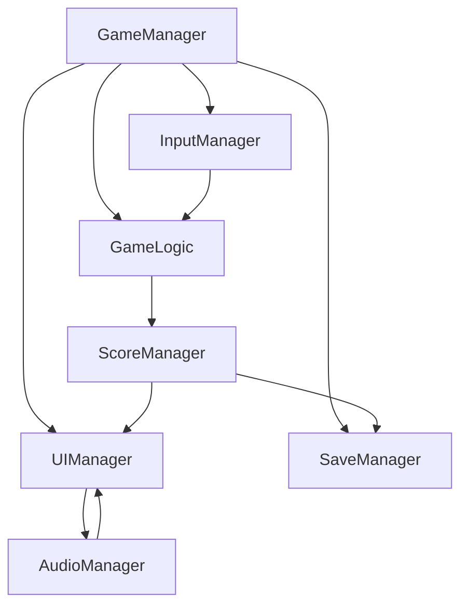

# Section 1: System Architecture

> **Technical Design Specification for Number Guessing Game**
> **Complexity Level:** Simple
> **Generated:** 2025-08-16

---

## **1. SYSTEM ARCHITECTURE** *(High-Level Overview)*

### **1.1 System Dependency Map**

**Purpose & Design Rationale:**
The system architecture for "Number Guessing Game" reflects the **"Pure Logic"** and **"Immediate Clarity"** design pillars from the GDD. Unlike action games that prioritize real-time responsiveness, this casual puzzle game emphasizes **deterministic feedback** and **simple state management**, driving an architecture that supports **predictable logical interactions** and **instant comprehension**.

**System Dependencies - Detailed Analysis:**



**Critical Path Analysis:**

1. **GameManager** initializes first (foundational singleton managing overall game state and scene coordination)
2. **SaveManager** establishes persistent data framework (loads best scores and player preferences before UI needs them)
3. **GameLogic** creates core number generation and validation systems (must be ready before player can interact)
4. **InputManager** enables player number entry and submission (depends on GameLogic for validation)
5. **UIManager, ScoreManager, AudioManager** are consumers that respond to game state changes and provide feedback

**Why This Architecture for Casual Puzzle:**

- **Single-threaded simplicity:** All systems operate synchronously because logical deduction requires no real-time pressure
- **Event-driven clarity:** UI updates immediately on game state changes rather than polling, supporting "Immediate Clarity" pillar
- **Minimal state complexity:** Only three core states (Playing, Won, Lost) eliminate complex state management overhead
- **Direct dependency chains:** Systems can directly call each other since performance bottlenecks are minimal

**System Lifecycle Management:**
Systems initialize once at game start and persist through play sessions. State changes trigger events rather than system destruction/recreation, supporting the simple session pattern of repeated quick games.

### **1.2 Component Hierarchy**

**Unity Scene Architecture - Design Reasoning:**
The scene hierarchy reflects the **"Satisfying Progress"** design pillar while supporting the **"lightweight CPU-based processing"** requirement. The organization prioritizes **immediate UI responsiveness** and **clear system separation** over complex nested hierarchies.

**Recommended Scene Organization with Detailed Rationale:**

```
NumberGuessingGame (Scene Root)
├── _GameSystems (Empty GameObject - Persistent managers)
│   ├── GameManager (Singleton + GameLogic + SaveManager)
│   ├── UIManager (Canvas references + UI state management)
│   └── AudioManager (Audio sources + sound effect management)
├── GameplayArea (Empty GameObject - Core interaction zone)
│   ├── InputField (TMP_InputField + number validation)
│   ├── SubmitButton (Button + input processing triggers)
│   └── FeedbackDisplay (TextMeshPro + dynamic feedback text)
├── ProgressTracking (Empty GameObject - Player progress UI)
│   ├── AttemptCounter (TextMeshPro + real-time attempt display)
│   ├── BestScoreDisplay (TextMeshPro + persistent best score)
│   └── GuessHistory (ScrollRect + dynamic guess list)
└── MenuSystem (Canvas - Game state UI)
    ├── MainMenu (Start game, settings, quit)
    ├── GameOverScreen (Win/lose screens + restart options)
    └── SettingsPanel (Audio, display options)
```

**Design Decisions & Rationale:**

**Core Systems Organization:**
- **Centralized managers:** Single GameObjects with multiple components reduce reference complexity for solo development
- **UI separation:** Gameplay UI separate from menu UI for clear state management and performance optimization
- **Direct component references:** No deep nesting reduces GetComponent calls and improves performance

**Gameplay Focus:**
- **Input-first design:** InputField appears prominently since number entry is the primary interaction
- **Progress visibility:** Attempt tracking and history prominently placed to support "Satisfying Progress" pillar
- **Immediate feedback zone:** FeedbackDisplay positioned for instant visual response to player actions

**Performance Considerations:**
- **Minimal GameObjects:** Flat hierarchy reduces Transform calculations and scene complexity
- **Component grouping:** Related systems on single GameObjects minimize reference lookups
- **UI pooling preparation:** GuessHistory designed for potential object pooling if list grows large

### **1.3 Manager Pattern Structure**

**Manager Architecture Philosophy:**
The manager pattern for "Number Guessing Game" reflects the **solo developer** constraint while supporting the **immediate feedback and persistent progress** requirements. The architecture prioritizes **simplicity and maintainability** over enterprise patterns, since casual puzzle games benefit from direct, comprehensible code organization.

**Core Manager Design Pattern:**

```csharp
public abstract class BaseGameManager : MonoBehaviour
{
    public abstract string SystemName { get; }
    public abstract int InitializationOrder { get; }
    public bool IsInitialized { get; private set; }

    [Header("Game Integration")]
    public bool enableDebugLogging = true;
    public bool autoInitialize = true;

    public virtual bool Initialize()
    {
        bool success = OnInitialize();
        if (success)
        {
            IsInitialized = true;
            RegisterGameEventHandlers();
            if (enableDebugLogging)
                Debug.Log($"{SystemName} initialized successfully");
        }
        return success;
    }

    protected abstract bool OnInitialize();
    protected virtual void RegisterGameEventHandlers() { }
    public abstract void OnGameStateChanged(GameState newState);
    public abstract void OnNewGameStarted();
}
```

**Manager Implementation Strategy:**

| Manager Type | Pattern Used | Justification | Key Responsibilities |
| --- | --- | --- | --- |
| **GameManager** | Singleton MonoBehaviour | Central coordination point for all systems | Game state management, system initialization, core game loop coordination |
| **InputManager** | Component-based | Input handling needs MonoBehaviour lifecycle | Number input validation, submission processing, UI input event management |
| **UIManager** | Singleton with component references | Single point for all UI updates | Canvas management, text updates, screen transitions, UI state synchronization |
| **AudioManager** | Static utility with MonoBehaviour | Audio doesn't need instance state | Sound effect playback, volume control, audio resource management |

**Why These Patterns for Casual Puzzle:**

- **Singleton simplicity:** GameManager and UIManager use singletons because the game has only one instance of each system
- **Component integration:** InputManager remains component-based to leverage Unity's input system integration seamlessly
- **Direct communication:** Managers can directly reference each other since system count is low and performance impact minimal

**Initialization Order Management:**

```csharp
public enum ManagerInitOrder
{
    GameManager = 1,        // Must initialize first to establish game state
    SaveManager = 2,        // Load persistent data before UI needs it
    AudioManager = 3,       // Initialize audio before any sound triggers
    InputManager = 4,       // Input depends on game state being ready
    UIManager = 5,         // UI updates depend on all other systems
}
```

**Manager Communication Philosophy:**
The "Immediate Clarity" pillar drives a **direct method call approach** where input events trigger immediate responses through manager method calls rather than complex event queuing.

### **1.4 Event/Communication Architecture**

**Communication Strategy Rationale:**
The **"Pure Logic"** design pillar drives a **direct response communication approach**: player actions trigger immediate feedback validation across simple systems to create predictable, comprehensible behavior.

**Event System Design:**

```csharp
public static class GameEvents
{
    // Core Gameplay Events (immediate response coordination)
    public static event System.Action<int> OnGuessSubmitted;
    public static event System.Action<GuessResult> OnGuessProcessed;
    public static event System.Action<GameState> OnGameStateChanged;

    // Progress Tracking Events (satisfying progress coordination)
    public static event System.Action<int> OnAttemptCountChanged;
    public static event System.Action<int> OnBestScoreUpdated;
    public static event System.Action OnNewGameStarted;

    // UI Feedback Events (immediate clarity coordination)
    public static event System.Action<string> OnFeedbackDisplayUpdated;
    public static event System.Action<bool> OnInputValidationChanged;

    // Event raising with immediate coordination
    public static void RaiseGuessSubmitted(int guess)
    {
        OnGuessSubmitted?.Invoke(guess);
        // Immediate audio feedback for input
        AudioManager.PlaySound(SoundType.ButtonClick);
    }

    public static void RaiseGuessProcessed(GuessResult result)
    {
        OnGuessProcessed?.Invoke(result);
        // Immediate UI update coordination
        UIManager.Instance?.UpdateFeedbackDisplay(result.FeedbackText);
    }
}
```

**Communication Pattern Decisions:**

| Communication Type | Usage Scenario | Performance Impact | Justification |
| --- | --- | --- | --- |
| **Direct Method Calls** | Input validation, game logic calculations | Minimal (synchronous, no overhead) | Perfect for immediate logical validation where response must be instant |
| **Static Events** | UI updates, progress tracking | Low (simple delegate calls) | Enables multiple UI elements to respond to single game events without tight coupling |
| **Property Notifications** | Score updates, state changes | Minimal (getter/setter calls) | Allows UI bindings to automatically update when core data changes |

**Why This Direct Response Architecture:**

- **Immediate feedback:** Events ensure UI responds instantly to player actions, supporting "Immediate Clarity" pillar
- **Logical consistency:** Direct method calls can validate input synchronously without race conditions or timing issues
- **Progress satisfaction:** Multiple UI elements can simultaneously respond to achievement events for comprehensive feedback
- **Simple debugging:** Direct call chains make logic flow easy to trace and debug for solo development

**Event Processing Philosophy:**
The communication architecture serves the game's logical, turn-based nature where each player action creates immediate, deterministic responses across all relevant systems simultaneously, eliminating complex async coordination while maintaining clean system separation.

---

**Next Section:** Section 2 (Gameplay Architecture) - Specific implementation of game mechanics and interactions