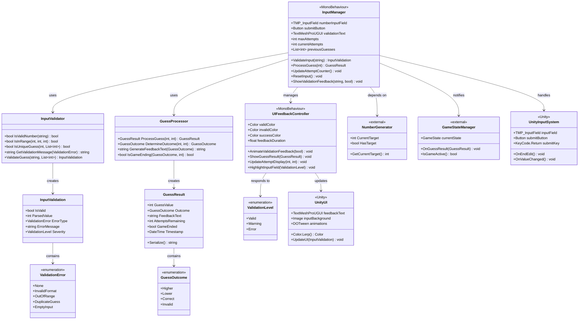
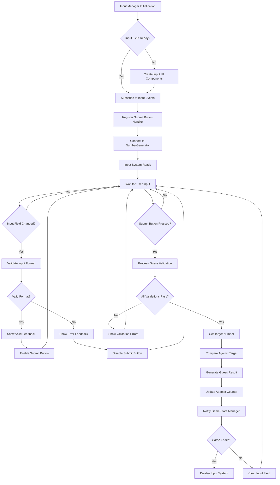
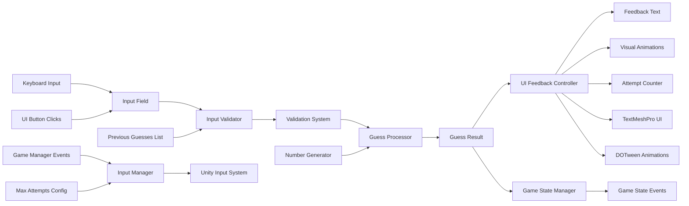

# **FEATURE TASK BREAKDOWN**

## **FEATURE 1.1.2: Complete Input & Validation System** *(Total Duration: 20 hours)*

> **Generated using Enhanced Task Breakdown Framework with MVP Validation**
> **Source Epic:** Epic 1.1 - Core Game Logic System
> **Complexity Level:** Simple
> **Context Integration:** GDD + TDS + Epic Specification
> **MVP Priority Level:** 2 (Input Handling) - ✅ APPROVED
> **Development Phase:** foundation
> **Generated:** 2025-08-16

### **FEATURE OVERVIEW**

**Purpose:** Implement comprehensive input handling that validates player number entries, processes guesses against the target number, and provides clear, immediate feedback to support the "Immediate Clarity" design pillar from the GDD.

**Complexity:** Medium - Requires coordinated UI input handling, validation logic, feedback systems, and integration with NumberGenerator for target comparison.

**Main Deliverables:** InputManager MonoBehaviour, validation system, GuessResult data structure, UI integration, and attempt tracking with configurable limits.

**Player Experience Context (from GDD):**
This feature enables the core "Number Input" and "Guess Submission" primary mechanics, providing players with immediate feedback that supports logical deduction strategy. Players must receive clear validation for range (1-100) and format errors, with "Higher," "Lower," or "Correct!" responses that eliminate ambiguity. The system supports the "Pure Logic" design pillar by ensuring every guess provides meaningful, consistent information.

**Technical Architecture Context (from TDS):**
The InputManager integrates with the GameManager-centered architecture, serving as a consumer of GameLogic for target number validation. Follows the event-driven clarity pattern where UI updates immediately on validation changes. Implements synchronous validation processing suitable for casual puzzle gameplay without real-time pressure.

**Epic Integration Context:**
This feature depends on Feature 1.1.1 (Random Number Generation System) for target numbers and enables Feature 1.1.3 (Game State Management System) by providing GuessResult data for state transitions. Creates the foundational input/validation infrastructure that all subsequent UI and interaction features will build upon.

### **FEATURE ARCHITECTURE DIAGRAM**

> **🎯 CUSTOMIZATION REQUIRED**: Replace generic class names with feature-specific classes.
> Analyze the epic specification and TDS to identify actual classes, methods, and relationships.
> Include Unity components (MonoBehaviour, ScriptableObject) relevant to this feature.
> Map external dependencies to specific systems mentioned in epic context.

**UML Class and Functional Hierarchy:**


**Component Dependency Flow:**


**Data Flow Architecture:**


### **TASK BREAKDOWN STRATEGY**

**Breakdown Rationale:** Tasks are organized by functional responsibility and Unity component architecture. The division separates validation logic from UI management, allowing parallel development of core logic and visual feedback systems. Each task represents a discrete, testable component that integrates cleanly with the overall system.

**Technical Architecture Considerations:**
- Unity Input System integration for modern input handling
- MonoBehaviour pattern for Unity lifecycle management 
- Data structure design for GuessResult enables clean state transitions
- Separation of validation logic from UI feedback supports testing and maintainability
- Event-driven pattern enables decoupled communication with GameStateManager

**Task Sequencing Logic:** Tasks 1-2 establish core data structures and validation logic (foundation), Task 3 implements Unity-specific input handling (core functionality), Tasks 4-5 add UI feedback and attempt tracking (user experience), Task 6 handles integration and testing (quality assurance). This sequence allows early testing of validation logic before UI complexity.

**Complexity Scaling Applied:**
- Task count: 6 (within simple complexity range of 3-7)
- Task duration: 2-4 hours per task for simple project requirements
- Taxonomy distribution: Balanced across Input Handling (2.2), UI Components (2.1), and Testing (7.1)

---

### **CONSTITUENT TASKS**

#### **TASK 1.1.2.1: [2.2 Input Handling] Input Validation Data Structures** *(Duration: 2 hours)*

| Task Details | Description |
|--------------|-------------|
| **Taxonomy Category** | 2.2 Input Handling - Core validation data structures |
| **Prerequisites** | Feature 1.1.1 (NumberGenerator) must be complete for target number access |
| **Main Deliverable** | InputValidation and GuessResult data structures with validation enums |
| **Integration Points** | Designed for use by InputValidator and GuessProcessor classes |

**Observable Behaviors:**
- InputValidation struct properly encapsulates validation results with error types
- GuessResult struct contains all data needed for game state transitions
- ValidationError enum covers all anticipated input error scenarios
- Data structures serialize/deserialize correctly for potential save functionality

**Success Criteria:**
- [ ] InputValidation struct validates format, range, and uniqueness constraints
- [ ] GuessResult struct contains guess value, outcome, feedback text, attempts remaining, and game ended flag
- [ ] ValidationError enum includes InvalidFormat, OutOfRange, DuplicateGuess, EmptyInput types
- [ ] GuessOutcome enum provides Higher, Lower, Correct, Invalid options
- [ ] All data structures have proper ToString() methods for debugging

**Technical Requirements:**
```csharp
public struct InputValidation
{
    public bool IsValid;
    public int ParsedValue;
    public ValidationError ErrorType;
    public string ErrorMessage;
    public ValidationLevel Severity;
}

public struct GuessResult
{
    public int GuessValue;
    public GuessOutcome Outcome;
    public string FeedbackText;
    public int AttemptsRemaining;
    public bool GameEnded;
    public DateTime Timestamp;
}
```

**Implementation Guidance:**
- Use structs for value-type semantics and reduced memory allocation
- Include comprehensive error messaging for debugging support
- Design for JSON serialization if save/load functionality is needed later
- Follow Unity coding conventions for public struct formatting

---

#### **TASK 1.1.2.2: [2.2 Input Handling] Core Input Validation Logic** *(Duration: 3 hours)*

| Task Details | Description |
|--------------|-------------|
| **Taxonomy Category** | 2.2 Input Handling - Validation algorithms and logic |
| **Prerequisites** | Task 1.1.2.1 (data structures) must be complete |
| **Main Deliverable** | InputValidator class with comprehensive validation methods |
| **Integration Points** | Used by InputManager for all input validation operations |

**Observable Behaviors:**
- String input correctly parsed to integer with error handling
- Range validation enforces 1-100 bounds consistently
- Duplicate guess detection works across game session
- Validation messages provide clear, user-friendly feedback

**Success Criteria:**
- [ ] Number parsing handles invalid formats (letters, decimals, empty) gracefully
- [ ] Range validation correctly identifies values outside 1-100 bounds
- [ ] Duplicate detection prevents re-guessing same numbers within session
- [ ] Validation messages are clear and actionable for players
- [ ] Edge cases handled: leading/trailing spaces, negative numbers, zero

**Technical Requirements:**
```csharp
public class InputValidator
{
    public static bool IsValidNumber(string input, out int result);
    public static bool IsInRange(int value, int min, int max);
    public static bool IsUniqueGuess(int value, List<int> previousGuesses);
    public static string GetValidationMessage(ValidationError errorType);
    public static InputValidation ValidateGuess(string input, List<int> previousGuesses);
}
```

**Implementation Guidance:**
- Use int.TryParse() for safe number conversion
- Implement comprehensive unit tests for all validation scenarios
- Design validation methods as static utilities for easy testing
- Include comprehensive error message dictionary for localization support

---

#### **TASK 1.1.2.3: [2.2 Input Handling] Unity Input System Integration** *(Duration: 4 hours)*

| Task Details | Description |
|--------------|-------------|
| **Taxonomy Category** | 2.2 Input Handling - Unity-specific input management |
| **Prerequisites** | Task 1.1.2.2 (validation logic) must be complete |
| **Main Deliverable** | InputManager MonoBehaviour with Unity UI integration |
| **Integration Points** | Connects to TMP_InputField, Button, and NumberGenerator systems |

**Observable Behaviors:**
- Input field responds to both keyboard typing and paste operations
- Submit button enables/disables based on validation state
- Enter key submission works alongside button clicking
- Input field clears appropriately after successful submission

**Success Criteria:**
- [ ] TMP_InputField configured with proper number input restrictions
- [ ] Submit button responds to both click and Enter key press
- [ ] Real-time validation feedback updates as user types
- [ ] Input field automatically focuses for immediate player interaction
- [ ] Previous guesses list maintained throughout game session

**Technical Requirements:**
```csharp
public class InputManager : MonoBehaviour
{
    [Header("Input Configuration")]
    public TMP_InputField numberInputField;
    public Button submitButton;
    public int maxAttempts = 10;
    
    [Header("Dependencies")]
    public NumberGenerator numberGenerator;
    
    private List<int> previousGuesses = new List<int>();
    private int currentAttempts = 0;
}
```

**Implementation Guidance:**
- Configure TMP_InputField with numeric content type and 1-100 character limit
- Use UnityEvents for button OnClick and input field OnEndEdit handlers
- Implement proper null checking for component references
- Follow Unity MonoBehaviour best practices for initialization order

---

#### **TASK 1.1.2.4: [2.1 UI Components] Guess Processing and Feedback System** *(Duration: 4 hours)*

| Task Details | Description |
|--------------|-------------|
| **Taxonomy Category** | 2.1 UI Components - User feedback and result processing |
| **Prerequisites** | Task 1.1.2.3 (input system) must be complete |
| **Main Deliverable** | GuessProcessor class and UIFeedbackController for player feedback |
| **Integration Points** | Processes results from InputManager and coordinates with NumberGenerator |

**Observable Behaviors:**
- Accurate "Higher," "Lower," or "Correct!" feedback for all guess scenarios
- Visual feedback clearly distinguishes between different validation states
- Feedback messages appear immediately without delay or ambiguity
- Color coding and animations enhance feedback clarity

**Success Criteria:**
- [ ] Comparison logic correctly determines Higher/Lower/Correct outcomes
- [ ] Feedback text generated appropriately for each guess result type
- [ ] UI elements update colors based on validation state (green/red/gold)
- [ ] Feedback animations play smoothly without interfering with next input
- [ ] Game ending detection works for both win and maximum attempts scenarios

**Technical Requirements:**
```csharp
public class GuessProcessor
{
    public static GuessResult ProcessGuess(int guess, int target, int attemptsRemaining);
    private static GuessOutcome DetermineOutcome(int guess, int target);
    private static string GenerateFeedbackText(GuessOutcome outcome);
    private static bool IsGameEnding(GuessOutcome outcome, int attemptsRemaining);
}

public class UIFeedbackController : MonoBehaviour
{
    public void ShowGuessResult(GuessResult result);
    public void ShowValidationFeedback(InputValidation validation);
    public void AnimateSubmissionFeedback();
}
```

**Implementation Guidance:**
- Use consistent feedback text that matches GDD requirements exactly
- Implement smooth color transitions using Unity's Color.Lerp or DOTween
- Design feedback system to be easily extensible for sound effects later
- Ensure feedback clears appropriately for next guess attempt

---

#### **TASK 1.1.2.5: [2.1 UI Components] Attempt Tracking and Display System** *(Duration: 3 hours)*

| Task Details | Description |
|--------------|-------------|
| **Taxonomy Category** | 2.1 UI Components - Progress tracking and player information |
| **Prerequisites** | Task 1.1.2.4 (feedback system) must be complete |
| **Main Deliverable** | Attempt counter UI and tracking logic with maximum attempts enforcement |
| **Integration Points** | Updates UI based on InputManager state and triggers GameStateManager events |

**Observable Behaviors:**
- Attempt counter displays current attempts and maximum limit clearly
- Counter updates immediately after each valid guess submission
- Visual warning appears as player approaches maximum attempts
- Game over trigger activates precisely at maximum attempts reached

**Success Criteria:**
- [ ] Attempt counter shows format "X / 10" or similar clear progress indication
- [ ] Counter increments only for valid, processed guesses (not validation errors)
- [ ] Visual styling changes color/urgency as attempts approach maximum
- [ ] Maximum attempts enforcement triggers game over state correctly
- [ ] Reset functionality properly zeroes attempt counter for new games

**Technical Requirements:**
```csharp
// Extension to InputManager
private void UpdateAttemptCounter()
{
    currentAttempts++;
    attemptCounterText.text = $"{currentAttempts} / {maxAttempts}";
    
    if (currentAttempts >= maxAttempts)
    {
        TriggerGameOver();
    }
    
    UpdateAttemptCounterVisuals();
}
```

**Implementation Guidance:**
- Use TextMeshPro for crisp text rendering at different screen sizes
- Implement visual warning system (color changes) at 80% of maximum attempts
- Design counter to be easily configurable for different difficulty settings
- Ensure proper integration with GameStateManager for state transitions

---

#### **TASK 1.1.2.6: [7.1 Unit Testing] Integration Testing and Validation** *(Duration: 4 hours)*

| Task Details | Description |
|--------------|-------------|
| **Taxonomy Category** | 7.1 Unit Testing - Comprehensive feature validation |
| **Prerequisites** | Tasks 1.1.2.1-5 (all implementation tasks) must be complete |
| **Main Deliverable** | Complete test suite and integration validation for Feature 1.1.2 |
| **Integration Points** | Tests all components and their interactions with NumberGenerator |

**Observable Behaviors:**
- All validation scenarios tested with automated test cases
- Integration with NumberGenerator verified through multiple game sessions
- Edge cases and error conditions handled gracefully
- Performance meets requirements for responsive input handling

**Success Criteria:**
- [ ] Unit tests cover all validation methods with 90%+ code coverage
- [ ] Integration tests verify proper NumberGenerator target number usage
- [ ] Edge case testing includes boundary values, invalid formats, and duplicate guesses
- [ ] Performance testing confirms sub-100ms response time for validation operations
- [ ] Manual testing validates complete user experience flow

**Technical Requirements:**
```csharp
[TestFixture]
public class InputValidationTests
{
    [Test] public void ValidateGuess_ValidNumber_ReturnsValid();
    [Test] public void ValidateGuess_OutOfRange_ReturnsRangeError();
    [Test] public void ValidateGuess_InvalidFormat_ReturnsFormatError();
    [Test] public void ValidateGuess_DuplicateNumber_ReturnsDuplicateError();
    [Test] public void ProcessGuess_CorrectAnswer_ReturnsCorrectOutcome();
    [Test] public void ProcessGuess_LowerNumber_ReturnsHigherOutcome();
    [Test] public void ProcessGuess_HigherNumber_ReturnsLowerOutcome();
}
```

**Implementation Guidance:**
- Use Unity Test Framework for automated testing infrastructure
- Create test scenarios covering all GDD-specified user interactions
- Include integration tests with actual NumberGenerator instances
- Document test cases for future feature validation

---

### **TASK DEPENDENCY CHAIN**

**Visual Dependency Map:**
```
Task 1.1.2.1 ─┐
               ├─→ Task 1.1.2.3 ─→ Task 1.1.2.4 ─→ Task 1.1.2.6 ─→ Feature Complete
Task 1.1.2.2 ─┘                    ↓
                                Task 1.1.2.5 ─┘
```

**Critical Dependencies Analysis:**
- **Task 1.1.2.3** requires Tasks 1.1.2.1 & 1.1.2.2 because: Input handling needs data structures and validation logic before Unity integration
- **Task 1.1.2.4** requires Task 1.1.2.3 because: Feedback system depends on input events and user interaction infrastructure
- **Task 1.1.2.5** can run parallel to Task 1.1.2.4 because: Attempt tracking is independent of guess processing logic
- **Task 1.1.2.6** requires all previous tasks because: Integration testing validates complete feature functionality

**External Dependencies:**
- **Feature 1.1.1** (NumberGenerator) must provide CurrentTarget property and HasTarget status
- **Unity Input System** package must be installed and configured in project
- **TextMeshPro** package required for UI text rendering components

### **INTEGRATION POINTS**

**Feature Integration:** 
The six tasks combine to create a complete input and validation system where data structures (Tasks 1-2) provide the foundation for Unity input handling (Task 3), which enables guess processing and feedback (Tasks 4-5), all validated through comprehensive testing (Task 6). The architecture supports the "Immediate Clarity" design pillar through real-time validation feedback and clear result communication.

**Epic System Integration:** 
This feature integrates with Feature 1.1.1 (NumberGenerator) by consuming the CurrentTarget property for guess comparison, and enables Feature 1.1.3 (GameStateManager) by providing GuessResult events that trigger state transitions. The InputManager serves as the central coordinator between player input and game logic processing.

**Cross-Epic Integration:**
Future UI epics will extend the UIFeedbackController for enhanced visual effects, audio epics will hook into the feedback system for sound cues, and scoring epics will utilize the GuessResult data for performance analysis. The modular design ensures clean integration points for feature expansion.

**Unity Engine Integration:**
Deep integration with Unity's UI system through TMP_InputField and Button components, utilizing Unity's event system for input handling, and following MonoBehaviour lifecycle patterns for proper initialization and cleanup. The system leverages Unity's Input System for modern, flexible input management.

### **ARCHITECTURE & DESIGN CONSIDERATIONS**

**Unity Component Architecture:**
- InputManager MonoBehaviour manages UI references and coordinates input flow
- UIFeedbackController handles visual feedback and animation coordination
- Static utility classes for validation logic enable easy unit testing
- Proper component reference management through Inspector assignment

**System Design Patterns:**
- **Validator Pattern**: InputValidator provides centralized validation logic
- **Result Pattern**: GuessResult and InputValidation encapsulate operation outcomes
- **Observer Pattern**: Event-driven feedback updates for UI coordination
- **Unity MonoBehaviour Pattern**: Proper lifecycle management and component interaction

**Performance Considerations:**
- Validation operations complete in under 100ms for responsive input handling
- Minimal memory allocation through struct usage for data transfer
- Efficient string processing with pre-allocated StringBuilder for feedback generation
- UI update batching to avoid frame rate impact during rapid input changes

**Quality & Maintainability:**
- Clear separation between validation logic and UI presentation
- Comprehensive error handling with user-friendly message generation
- Extensible architecture supports future features like hint systems
- Full unit test coverage enables confident refactoring and feature additions

### **IMPLEMENTATION SEQUENCE & TIMELINE**

**Recommended Implementation Order:**
1. **Foundation Phase:** Tasks 1.1.2.1-2 (Data structures and validation logic) - 5 hours
2. **Core Implementation:** Task 1.1.2.3 (Unity integration) - 4 hours  
3. **User Experience:** Tasks 1.1.2.4-5 (Feedback and attempt tracking) - 7 hours
4. **Quality Assurance:** Task 1.1.2.6 (Testing and validation) - 4 hours

**Parallel Work Opportunities:**
- Tasks 1.1.2.1 and 1.1.2.2 can be developed simultaneously by different team members
- Task 1.1.2.5 (attempt tracking) can be developed in parallel with Task 1.1.2.4 (feedback)
- UI design work can proceed in parallel with core logic implementation

**Critical Path Analysis:**
- Total sequential time: 20 hours if no parallel work
- Optimized parallel time: 16 hours with identified parallel task execution
- Bottleneck tasks: Task 1.1.2.3 (Unity integration) blocks most subsequent work

### **TESTING & VALIDATION STRATEGY**

**Feature-Level Testing:**
- **Unit Testing**: All validation methods with comprehensive edge case coverage
- **Integration Testing**: Full feature interaction with NumberGenerator and UI systems
- **User Acceptance Testing**: Manual validation of all GDD-specified input behaviors
- **Performance Testing**: Response time validation for all input operations

**Validation Scenarios:**
- **Range Testing**: Values 0, 1, 100, 101 to verify boundary conditions
- **Format Testing**: Letters, decimals, empty input, special characters
- **Duplicate Testing**: Repeated guesses within single game session
- **Integration Testing**: Complete game flow from input to game state transition

**Quality Gates:**
- All unit tests pass with 90%+ code coverage
- Integration tests verify proper feature interaction
- Manual testing confirms GDD design pillar compliance
- Performance benchmarks meet 100ms response time requirement

---

## **FEATURE COMPLETION CRITERIA**

### **Definition of Done**
- [ ] All constituent tasks completed successfully with validated deliverables
- [ ] Feature integrates properly with Epic 1.1 architecture and NumberGenerator
- [ ] Player experience meets GDD requirements for "Immediate Clarity" and input handling
- [ ] Comprehensive testing validates all specified behaviors and edge cases
- [ ] Performance meets requirements for responsive casual puzzle gameplay
- [ ] Code quality meets project standards with proper documentation and test coverage

### **Player Experience Validation**
- [ ] Players can enter numbers 1-100 using keyboard or paste operations
- [ ] Immediate visual feedback for input validation errors (format, range, duplicates)
- [ ] Clear "Higher," "Lower," or "Correct!" feedback for all guess scenarios
- [ ] Attempt counter provides clear progress indication toward maximum limit
- [ ] Game over triggers correctly at maximum attempts with appropriate feedback

### **Technical Integration Validation**
- [ ] InputManager properly integrates with NumberGenerator for target comparison
- [ ] GuessResult events enable clean integration with GameStateManager
- [ ] UI feedback system provides foundation for future visual and audio enhancements
- [ ] Input validation supports extensibility for difficulty levels and game modes

---

*Generated using Enhanced Task Breakdown Framework with integrated GDD context, TDS architecture analysis, and MVP-compliant development ordering*