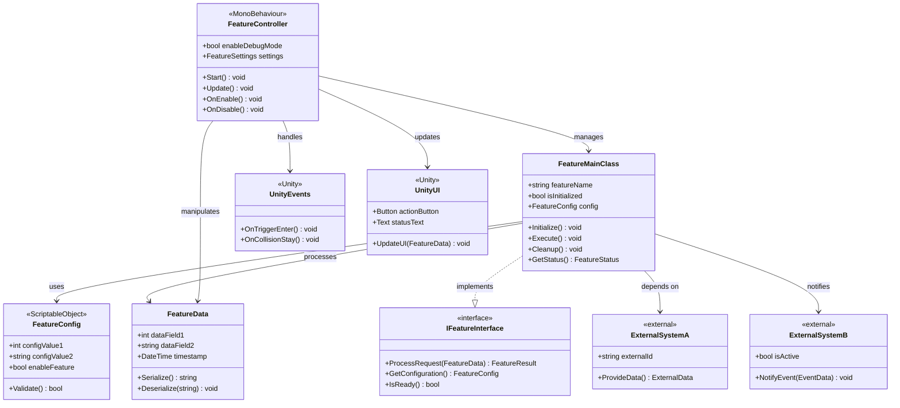
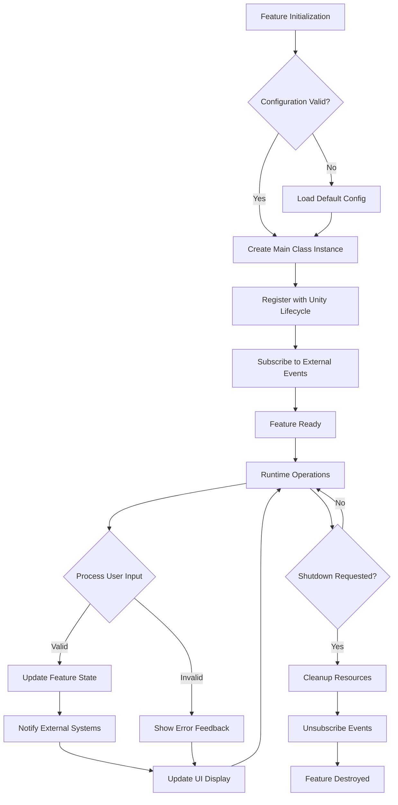
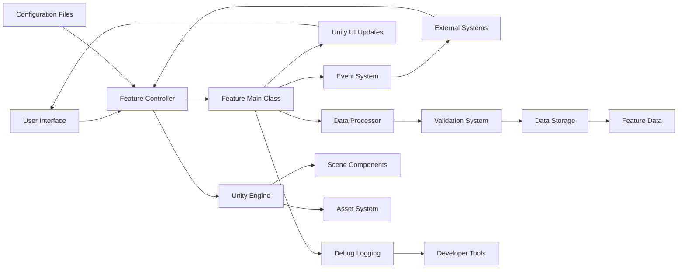

# Generate Feature Tasks Command

## Purpose
Generate comprehensive task breakdowns with detailed specifications for features within epics. Creates thorough task documentation combining technical analysis, Unity game development taxonomy categorization, and context-aware implementation guidance derived from GDD, TDS, and Epic specifications for complete development readiness.

## Prerequisites
- ✅ Epic specifications complete (generate-epic-details command)
- ✅ GDD and TDS documents complete for context analysis
- ✅ project-parameters.yaml configured
- ✅ Epic specification files exist in docs/epics/

## Usage

### Process All Features (Default)
```bash
# Generate task breakdowns for ALL features across ALL epics
generate-feature-tasks --all

# With Linear issue creation
generate-feature-tasks --all --create-linear-issues
```

### Process All Features in Epic
```bash
# Generate task breakdowns for ALL features in specified epic
generate-feature-tasks --epic 1.1

# With Linear tracking
generate-feature-tasks --epic 1.1 --create-linear-issues
```

### Process Specific Feature(s)
```bash
# Single feature
generate-feature-tasks --feature 1.1.1

# Multiple specific features
generate-feature-tasks --features 1.1.1,1.1.2,1.2.1

# Feature range within an epic
generate-feature-tasks --epic 1.1 --feature-range 1-3
```

### Process by Phase
```bash
# All features in all epics of a phase
generate-feature-tasks --phase 1

# Multiple phases
generate-feature-tasks --phases 1,2

# Phase range
generate-feature-tasks --phase-range 1-3
```

### Advanced Options
```bash
# Dry run - show what would be processed without generating
generate-feature-tasks --dry-run

# Force regeneration even if task documents exist
generate-feature-tasks --force

# Create Linear feature issues with task breakdowns
generate-feature-tasks --create-linear-issues

# Custom output directory
generate-feature-tasks --output-dir ./custom/tasks/

# Verbose mode with detailed logging
generate-feature-tasks --verbose

# Use specific complexity level override
generate-feature-tasks --complexity detailed

# Enhanced context analysis mode
generate-feature-tasks --deep-analysis
```

## Command Parameters

### Selection Parameters
- `--all` : Process all features across all epics (default if no params)
- `--epic <id>` : Process all features in epic (e.g., 1.1)
- `--epics <id,id,id>` : Process all features in multiple epics
- `--epic-range <start-end>` : Process epic range (e.g., 1.1-1.3)
- `--feature <id>` : Process specific feature (e.g., 1.1.1)
- `--features <id,id,id>` : Process multiple specific features
- `--feature-range <start-end>` : Process feature range within epic
- `--phase <n>` : Process all features in all epics of phase N

### Processing Options
- `--force` : Regenerate even if task documents exist
- `--dry-run` : Show what would be processed without generating
- `--verbose` : Enable detailed logging
- `--quiet` : Minimal output
- `--deep-analysis` : Enhanced context analysis with GDD/TDS integration

### Linear Integration Options
- `--create-linear-issues` : Create Linear feature issue with task breakdown
- `--linear-project <name>` : Specify Linear project (default from config)

### Configuration Overrides
- `--complexity <level>` : Override complexity (simple/intermediate/detailed)
- `--tasks-per-feature <n>` : Override task count (3-10)
- `--output-dir <path>` : Custom output directory

## Unity Game Development Taxonomy

The command automatically categorizes tasks using this comprehensive taxonomy:

### **1.x Core Logic & Systems**
- 1.1 Singleton Patterns
- 1.2 Event Systems
- 1.3 State Machines
- 1.4 Component Architecture
- 1.5 Testing & Debugging
- 1.6 Error Handling
- 1.7 Input Systems
- 1.8 UI Systems

### **2.x User Interface**
- 2.1 UI Components
- 2.2 Menu Systems
- 2.3 HUD Elements
- 2.4 UI Animation
- 2.5 Responsive Design
- 2.6 UI State Management

### **3.x Visual & Graphics**
- 3.1 Shader Development
- 3.2 Visual Effects
- 3.3 Lighting Setup
- 3.4 Material Creation
- 3.5 Post-Processing
- 3.6 Camera Systems

### **4.x Physics & Movement**
- 4.1 Character Controllers
- 4.2 Collision Detection
- 4.3 Rigidbody Setup
- 4.4 Physics Materials
- 4.5 Trigger Zones
- 4.6 Movement Mechanics

### **5.x AI & Behaviors**
- 5.1 Pathfinding
- 5.2 State Behaviors
- 5.3 Decision Trees
- 5.4 Enemy AI
- 5.5 NPC Systems
- 5.6 Behavior Patterns

### **6.x Data Management**
- 6.1 Save/Load Systems
- 6.2 ScriptableObjects
- 6.3 Data Persistence
- 6.4 Configuration Files
- 6.5 Localization
- 6.6 Asset Management

### **7.x Validation & Testing**
- 7.1 Unit Testing
- 7.2 Integration Testing
- 7.3 Debug Systems
- 7.4 Performance Profiling
- 7.5 Error Handling
- 7.6 Validation Rules

### **8.x Platform & Build**
- 8.1 Build Configuration
- 8.2 Platform Optimization
- 8.3 Input Systems
- 8.4 Cross-Platform
- 8.5 Deployment
- 8.6 Version Control

## Implementation

You are a specialized task generation assistant with expertise in Unity game development. When the user invokes this command, generate comprehensive task breakdowns using integrated technical analysis, combining epic context, GDD player experience requirements, and TDS architectural guidance.

### Phase 1: Comprehensive Context Loading with MVP Validation

```bash
# Load project parameters and paths
PROJECT_NAME={from project-parameters.yaml}
PROJECT_TYPE={from project-parameters.yaml}
BASE_DIRECTORY={from project-parameters.yaml}
COMPLEXITY_LEVEL={from project-parameters.yaml or --complexity flag}

# Load development constraints for task validation
CURRENT_PHASE={from project-parameters.yaml DEVELOPMENT_CONSTRAINTS.CURRENT_PHASE}
MVP_MODE={from project-parameters.yaml DEVELOPMENT_CONSTRAINTS.MVP_MODE}
PRIORITY_CEILING={from project-parameters.yaml DEVELOPMENT_CONSTRAINTS.PRIORITY_CEILING}
BLOCKED_FEATURES={from project-parameters.yaml DEVELOPMENT_CONSTRAINTS.MVP_BLOCKED_FEATURES}
TAXONOMY_PRIORITIES={from project-parameters.yaml TAXONOMY_PRIORITIES}
DEPENDENCY_RULES={from project-parameters.yaml DEPENDENCY_RULES}
EPIC_SPECS_PATH={BASE_DIRECTORY}/docs/epics/
TASK_OUTPUT_PATH={BASE_DIRECTORY}/docs/tasks/
GDD_PATH={BASE_DIRECTORY}/docs/{PROJECT_NAME}-GDD.md
TDS_PATH={BASE_DIRECTORY}/docs/TDS/
ROADMAP_PATH={BASE_DIRECTORY}/docs/{PROJECT_NAME}-Roadmap.md

echo "📚 Loading comprehensive project context..."

# Load all context documents for deep analysis
GDD_CONTENT=$(cat "$GDD_PATH")
TDS_CONTENT=$(find "$TDS_PATH" -name "*.md" -exec cat {} \;)
ROADMAP_CONTENT=$(cat "$ROADMAP_PATH")

# Determine task count based on complexity scaling
TASKS_PER_FEATURE_CONFIG={
  simple: 3-5 tasks per feature
  intermediate: 4-7 tasks per feature
  detailed: 6-10 tasks per feature
}

echo "🎯 Project Context Loaded:"
echo "   - Complexity Level: $COMPLEXITY_LEVEL"
echo "   - Target Tasks Per Feature: ${TASKS_PER_FEATURE_CONFIG[$COMPLEXITY_LEVEL]}"
echo "   - Unity Taxonomy: Full 8-category system"
echo "   - Context Sources: GDD + TDS + Epic Specs"

# Extract features from epic specifications
echo "📋 Analyzing epic specifications for feature extraction..."
AVAILABLE_EPICS=$(find "$EPIC_SPECS_PATH" -name "Epic-*.md" | sed 's/.*Epic-\([0-9.]*\)-Specification.md/\1/' | sort)

for EPIC in $AVAILABLE_EPICS; do
    EPIC_FILE="$EPIC_SPECS_PATH/Epic-$EPIC-Specification.md"
    EPIC_FEATURES=$(grep -o "FEATURE [0-9]\+\.[0-9]\+\.[0-9]\+:" "$EPIC_FILE" | sed 's/FEATURE \([0-9.]*\):.*/\1/' | sort)
    ALL_FEATURES="$ALL_FEATURES $EPIC_FEATURES"
done

echo "📊 Discovered Features: $(echo $ALL_FEATURES | wc -w) total"
echo "$ALL_FEATURES"

# 🚨 MVP CONSTRAINT VALIDATION FOR FEATURES
echo "🔍 Validating features against MVP constraints..."
VALIDATED_FEATURES=""
for feature in $ALL_FEATURES; do
    # Extract taxonomy category for priority mapping
    FEATURE_TAXONOMY=$(get_feature_taxonomy "$feature")
    FEATURE_PRIORITY=$(get_taxonomy_priority "$FEATURE_TAXONOMY")
    
    if [ "$MVP_MODE" = "true" ]; then
        if [ "$FEATURE_PRIORITY" -gt "$PRIORITY_CEILING" ]; then
            echo "❌ BLOCKED: Feature $feature (Priority $FEATURE_PRIORITY) exceeds MVP ceiling ($PRIORITY_CEILING)"
            echo "💡 RECOMMENDATION: Complete foundation features (Priority 0-3) first"
            continue
        fi
        
        # Check against blocked feature list
        FEATURE_DESCRIPTION=$(get_feature_description "$feature")
        for blocked in $BLOCKED_FEATURES; do
            if echo "$FEATURE_DESCRIPTION" | grep -qi "$blocked"; then
                echo "❌ BLOCKED: Feature $feature contains MVP-blocked elements: $blocked"
                continue 2
            fi
        done
    fi
    
    VALIDATED_FEATURES="$VALIDATED_FEATURES $feature"
    echo "✅ APPROVED: Feature $feature (Priority $FEATURE_PRIORITY) complies with MVP constraints"
done

echo "📋 Validated features for task generation:"
echo "$VALIDATED_FEATURES"
```

### Phase 2: Integrated Feature-to-Task Analysis Framework

For each selected feature, perform comprehensive breakdown using integrated methodology:

#### **Enhanced Task Generation Process**

```markdown
# Comprehensive Feature Analysis Framework:

FEATURE_ANALYSIS_METHODOLOGY:
  1. 🚨 MVP Constraint Validation:
     - Check feature priority against PRIORITY_CEILING
     - Validate against MVP_BLOCKED_FEATURES list
     - Ensure foundation dependencies are complete
     - Verify current development phase allows this feature
     
  2. Context Integration Analysis:
     - Extract feature details from epic specification
     - Cross-reference with GDD for player experience context
     - Analyze TDS for technical architecture requirements
     - Consider roadmap dependencies and constraints
     - Map feature to Unity Game Development Taxonomy
     
  3. Technical Architecture Assessment:
     - Identify core systems and Unity patterns required
     - Analyze component relationships and dependencies
     - Plan integration points with existing systems
     - Evaluate performance and quality requirements
     - Design UML class hierarchy for feature-specific implementation
     
  4. Task Decomposition Strategy:
     - Break feature into logical implementation units
     - Apply Unity taxonomy categorization
     - Ensure tasks meet complexity level constraints
     - Optimize task dependencies and sequencing
     
  5. Implementation Readiness Validation:
     - Verify each task has sufficient context
     - Ensure deliverables are clearly defined
     - Validate success criteria are measurable
     - Confirm integration points are specified
```

#### **Comprehensive Task Specification Template**

```markdown
# **FEATURE TASK BREAKDOWN**

## **FEATURE [X.Y.Z]: [Extract Feature Name from Epic]** *(Total Duration: [Extract Total Duration from Epic])*

> **Generated using Enhanced Task Breakdown Framework**
> **Source Epic:** Epic [X.Y] - [Epic Name]
> **Complexity Level:** {COMPLEXITY_LEVEL}
> **Context Integration:** GDD + TDS + Epic Specification
> **Generated:** {DATE}

### **FEATURE OVERVIEW**

**Purpose:** [Extract feature purpose from epic and cross-reference with GDD player value]
**Complexity:** [Assess complexity based on technical requirements and player impact]
**Main Deliverables:** [Extract primary deliverables and cross-reference with TDS architecture]

**Player Experience Context (from GDD):**
[Extract relevant player experience requirements and how this feature enhances gameplay]

**Technical Architecture Context (from TDS):**
[Extract relevant technical patterns, systems, and Unity-specific requirements]

**Epic Integration Context:**
[How this feature fits within the epic and contributes to epic-level goals]

### **FEATURE ARCHITECTURE DIAGRAM**

> **🎯 CUSTOMIZATION REQUIRED**: Replace generic class names with feature-specific classes.
> Analyze the epic specification and TDS to identify actual classes, methods, and relationships.
> Include Unity components (MonoBehaviour, ScriptableObject) relevant to this feature.
> Map external dependencies to specific systems mentioned in epic context.

**UML Class and Functional Hierarchy:**


**Component Dependency Flow:**


**Data Flow Architecture:**


### **TASK BREAKDOWN STRATEGY**

**Breakdown Rationale:** [Explain how task divisions were determined - by class architecture, functionality groups, dependency chains, Unity patterns, etc.]

**Technical Architecture Considerations:**
- Unity component structure and MonoBehaviour patterns
- Integration with existing systems from TDS
- Performance and quality requirements from epic
- Player experience touchpoints from GDD

**Task Sequencing Logic:** [Explain the order tasks must be completed and technical/architectural reasons]

**Complexity Scaling Applied:**
- Task count: {CALCULATED_TASK_COUNT} (within {COMPLEXITY_LEVEL} range)
- Task duration: 15-90 minutes per task for {COMPLEXITY_LEVEL} projects
- Taxonomy distribution: Balanced across relevant categories

---

### **CONSTITUENT TASKS**

#### **TASK [X.Y.Z.1]: [{TAXONOMY_CATEGORY}] {Task Name}** *(Duration: [15-90 minutes])*

| Task Details | Description |
|--------------|-------------|
| **Taxonomy Category** | **[X.Y Category Name]** - [Brief category description and expertise requirements] |
| **Purpose** | [What this specific task accomplishes in feature context] |
| **Scope** | [Exactly what is included/excluded - specific classes, methods, components] |
| **Complexity** | [Low/Medium assessed against complexity level constraints] |
| **Dependencies** | [What must exist before this task - from epic, other features, Unity] |
| **Primary Deliverable** | [Main file/class/system this task produces with exact naming] |

**Core Implementation Focus:**
[Primary class or system this task implements with key responsibilities and Unity patterns]

**GDD Context Integration:**
[How this task contributes to player experience goals from GDD analysis]

**TDS Architecture Alignment:**
[How this task implements or integrates with technical architecture from TDS]

**Key Technical Requirements:**
- [Specific Unity component or system requirement from epic/TDS]
- [Performance or quality constraint from epic definition]
- [Integration requirement with existing systems]
- [Platform or build consideration if applicable]

**Observable Behavior:**
[Specific, measurable behavior that proves task completion - what player or developer sees working]

**Success Criteria:**
- [ ] [Specific testable outcome with measurable result]
- [ ] [Integration checkpoint with other systems validation]
- [ ] [Performance or quality requirement achievement]
- [ ] [Unity Editor functionality or component setup verification]

**Testing Requirements:**
- [Unit testing approach for this specific task]
- [Integration testing with dependent systems]
- [Validation method for observable behavior]

**Implementation Guidance:**
- [Unity-specific implementation notes or patterns]
- [Key algorithms or approaches recommended]
- [Common pitfalls to avoid for this task type]

---

#### **TASK [X.Y.Z.2]: [{TAXONOMY_CATEGORY}] {Task Name}** *(Duration: [15-90 minutes])*

[Complete specification following same comprehensive format as Task 1]

#### **TASK [X.Y.Z.3]: [{TAXONOMY_CATEGORY}] {Task Name}** *(Duration: [15-90 minutes])*

[Complete specification following same comprehensive format as Tasks 1 & 2]

[Continue for all tasks in feature...]

---

### **TASK DEPENDENCY CHAIN**

**Visual Dependency Map:**
```
Task [X.Y.Z.1] ─┐
                ├─→ Task [X.Y.Z.3] ─→ Task [X.Y.Z.5] ─→ Feature Complete
Task [X.Y.Z.2] ─┘      ↓
                   Task [X.Y.Z.4]
```

**Critical Dependencies Analysis:**
- **Task [X.Y.Z.2]** requires Task [X.Y.Z.1] because: [specific technical reason - class inheritance, component setup, etc.]
- **Task [X.Y.Z.3]** requires Tasks [X.Y.Z.1] & [X.Y.Z.2] because: [integration reason with deliverables needed]
- **Task [X.Y.Z.4]** can run parallel to [X.Y.Z.3] because: [independence reason]

**External Dependencies:**
- [Dependencies on other features within epic]
- [Dependencies on systems from other epics]
- [Unity framework or external library dependencies]

### **INTEGRATION POINTS**

**Feature Integration:** 
[How these tasks combine to create the complete feature - technical architecture and component relationships]

**Epic System Integration:** 
[How this feature integrates with other features in the epic - APIs, events, data flow]

**Cross-Epic Integration:**
[How this feature integrates with systems from other epics - interfaces, dependencies]

**Unity Engine Integration:**
[How this feature integrates with Unity systems - MonoBehaviour lifecycle, events, assets]

### **ARCHITECTURE & DESIGN CONSIDERATIONS**

**Unity Component Architecture:**
- MonoBehaviour relationships and component dependencies
- Scene hierarchy and GameObject organization
- Prefab structure and instantiation patterns
- Asset references and management

**System Design Patterns:**
- [Design patterns used - Singleton, Observer, State Machine, etc.]
- [Unity-specific patterns - ScriptableObject, Events, Coroutines]
- [Integration patterns with existing systems]

**Performance Considerations:**
- Memory usage and garbage collection impact
- Frame rate requirements and optimization points
- Asset loading and caching strategies
- Platform-specific performance constraints

**Quality & Maintainability:**
- Code organization and namespace structure
- Documentation and commenting requirements
- Testing strategy and validation approach
- Error handling and edge case management

### **IMPLEMENTATION SEQUENCE & TIMELINE**

**Recommended Implementation Order:**
1. **Foundation Phase:** [Tasks that provide base infrastructure - data structures, base classes]
2. **Core Implementation:** [Tasks that implement main functionality]
3. **Integration Phase:** [Tasks that connect with other systems]
4. **Polish & Validation:** [Tasks that add quality, testing, error handling]

**Parallel Work Opportunities:**
- [Tasks that can be developed simultaneously]
- [Dependencies that don't create blocking chains]
- [Independent validation and testing tasks]

**Critical Path Analysis:**
- Total sequential time: [X hours] if no parallel work
- Optimized parallel time: [Y hours] with identified parallel tasks
- Bottleneck tasks: [Tasks that block the most other work]

### **TESTING & VALIDATION STRATEGY**

**Feature-Level Testing:**
- Integration testing approach for complete feature
- Player experience validation against GDD requirements
- Performance testing against epic-level targets
- Cross-system integration validation

**Task-Level Testing:**
- Unit testing requirements for each task
- Component testing in Unity Editor
- Automated validation where possible
- Manual testing procedures for player-facing elements

**Quality Gates:**
- Code review requirements and standards
- Documentation completeness validation
- Performance benchmark achievement
- Integration checkpoint validation

### **RISK ANALYSIS & MITIGATION**

**Technical Risks:**
- [Complex Unity integration challenges]
- [Performance or memory constraints]
- [Cross-platform compatibility issues]

**Dependency Risks:**
- [External system dependencies that might change]
- [Epic-level integration points that might not be ready]
- [Unity version or API compatibility risks]

**Mitigation Strategies:**
- [Fallback approaches for complex technical challenges]
- [Stub implementations for missing dependencies]
- [Performance testing and optimization plans]

---

## **FEATURE COMPLETION CRITERIA**

### **Definition of Done**
- [ ] All constituent tasks completed successfully with validated deliverables
- [ ] Feature integrates properly with epic-level architecture
- [ ] Player experience meets GDD requirements and expectations
- [ ] Technical implementation aligns with TDS architecture patterns
- [ ] Performance targets from epic specification achieved
- [ ] Unit test coverage meets complexity level requirements (Simple: >80%, Intermediate: >85%, Detailed: >90%)
- [ ] Integration testing with dependent systems completed
- [ ] Documentation and code comments meet project standards

### **Integration Readiness Checklist**
- [ ] Public APIs documented and validated
- [ ] Event system integration working
- [ ] Asset pipeline integration complete
- [ ] Platform compatibility verified
- [ ] Performance profiling completed
- [ ] Error handling and edge cases covered

### **Quality Validation**
- [ ] Code review completed and approved
- [ ] Player testing feedback addressed
- [ ] Technical debt documented and prioritized
- [ ] Maintainability standards met

**Total Estimated Duration:** {SUM_OF_TASK_HOURS} hours
**Critical Path:** [Task sequence that determines minimum completion time]
**Parallel Opportunities:** [Tasks that can be developed simultaneously]

---

*Generated using Integrated Feature-to-Task Framework with comprehensive GDD, TDS, and Epic context analysis*
```

### Phase 3: Advanced Task Generation Logic

#### **Integrated Task Breakdown Process**

```bash
For each feature in SELECTED_FEATURES:
  1. Comprehensive Context Analysis:
     - Load feature specification from epic document
     - Extract GDD context for player experience requirements
     - Analyze TDS architecture for technical patterns
     - Consider roadmap dependencies and constraints
     
  2. Feature Architecture Assessment:
     - Identify Unity systems and components required
     - Analyze integration points with existing systems
     - Plan component relationships and dependencies
     - Assess performance and quality requirements
     
  3. Task Decomposition with Taxonomy:
     - Break feature into implementation units
     - Apply Unity taxonomy categorization automatically:
       * UI Features → UI Components, UI State, Visual Feedback
       * Core Logic → System Architecture, State Management, Events
       * Gameplay → Input Handling, Physics, Game Logic
       * Data → Save/Load, Configuration, Persistence
     - Ensure diverse category coverage within feature
     - Scale task count based on complexity level
     
  4. Dependency Analysis and Optimization:
     - Map task dependencies within feature
     - Identify external dependencies from other features/epics
     - Optimize task sequence to minimize blocking
     - Plan parallel work opportunities
     
  5. Observable Behavior Definition:
     - Define specific, measurable outcomes for each task
     - Align behaviors with GDD player experience goals
     - Ensure behaviors are testable and validatable
     - Connect behaviors to epic-level acceptance criteria
     
  6. Quality and Integration Planning:
     - Define testing strategy for each task
     - Plan integration checkpoints with other systems
     - Establish performance targets and validation methods
     - Create documentation and maintainability requirements

TASK_COMPLEXITY_SCALING:
  simple_complexity:
    task_count: 3-5 per feature
    task_duration: 15-90 minutes each
    taxonomy_focus: Core categories (1.x, 2.x, 7.x)
    detail_level: Essential implementation only
    
  intermediate_complexity:
    task_count: 4-7 per feature
    task_duration: 30-120 minutes each
    taxonomy_focus: Balanced across all relevant categories
    detail_level: Standard implementation with quality measures
    
  detailed_complexity:
    task_count: 6-10 per feature
    task_duration: 45-180 minutes each
    taxonomy_focus: Comprehensive coverage including optimization
    detail_level: Full implementation with extensive validation

TAXONOMY_AUTO_ASSIGNMENT:
  feature_type_patterns:
    ui_features: [2.1 UI Components, 2.2 Menu Systems, 2.6 UI State Management]
    core_logic: [1.4 Component Architecture, 1.3 State Machines, 1.2 Event Systems]
    gameplay: [1.7 Input Systems, 4.x Physics, 5.x AI Behaviors]
    data_systems: [6.1 Save/Load, 6.2 Configuration, 6.3 Asset Management]
    testing: [7.1 Unit Testing, 7.2 Integration Testing, 7.3 Debug Systems]
```

#### **Mermaid UML Diagram Generation Guidelines**

```bash
# Feature-Specific Architecture Diagram Customization
MERMAID_DIAGRAM_GENERATION:
  class_diagram_customization:
    - Replace "FeatureMainClass" with actual primary class name from feature analysis
    - Add feature-specific methods and properties based on TDS requirements
    - Include Unity component types relevant to feature (MonoBehaviour, ScriptableObject, etc.)
    - Map external dependencies to specific systems from epic context
    - Add interfaces that feature must implement for integration
    - Include data structures specific to feature functionality
    
  component_flow_customization:
    - Map initialization steps to feature-specific setup requirements
    - Include feature-specific validation and error handling paths
    - Add runtime operations specific to feature's user interaction patterns
    - Include cleanup procedures relevant to feature's resource usage
    
  data_flow_customization:
    - Replace generic input sources with feature-specific data sources
    - Map processing steps to feature's core logic operations
    - Include feature-specific validation and transformation steps
    - Add output destinations relevant to feature's integration points
    - Include Unity-specific integration points (Scene, Assets, Events)

# Example Customization for NumberGenerator Feature:
EXAMPLE_CUSTOMIZATION:
  replace_generic_classes:
    FeatureMainClass -> NumberGenerator
    FeatureController -> NumberGeneratorController
    FeatureConfig -> NumberGeneratorConfig
    FeatureData -> GenerationParameters
    
  add_specific_methods:
    +GenerateNewTarget() int
    +EnableDebugMode(int) void
    +ValidateRange(int, int) bool
    +GetCurrentTarget() int
    
  include_dependencies:
    External Systems -> [GameStateManager, StatisticalValidator]
    Unity Components -> [Random, Debug, Events]
```

#### **Enhanced Quality Assurance Integration**

```bash
# Comprehensive validation of generated task breakdowns
ADVANCED_VALIDATION_CHECKS:
  structural_validation:
    - Feature duration matches epic allocation exactly
    - Task count within complexity level constraints
    - All required sections present and complete
    - Taxonomy categories valid and well-distributed
    - Mermaid UML diagrams present and feature-specific
    - Architecture diagrams reflect actual feature classes and relationships
    
  content_quality_validation:
    - Observable behaviors are specific and measurable
    - Success criteria use proper checkbox format
    - Technical requirements align with TDS patterns
    - GDD context properly integrated into task purpose
    
  dependency_validation:
    - No circular dependencies within feature
    - External dependencies are valid and achievable
    - Task sequence creates valid implementation path
    - Integration points properly specified
    
  unity_specific_validation:
    - MonoBehaviour patterns correctly applied
    - Component architecture follows Unity best practices
    - Asset management and Scene organization planned
    - Platform considerations addressed appropriately

QUALITY_METRICS_REPORTING:
  taxonomy_distribution_analysis:
    - Coverage across relevant taxonomy categories
    - Balance between implementation and validation tasks
    - Appropriate distribution for feature complexity
    
  dependency_complexity_assessment:
    - Critical path analysis and optimization opportunities
    - External dependency risk evaluation
    - Parallel work opportunity identification
    
  implementation_readiness_score:
    - Context completeness for independent implementation
    - Technical specification detail and clarity
    - Success criteria measurability and testability
```

### Phase 4: Linear Integration (Enhanced)

If `--create-linear-issues` flag is provided:

```bash
For each feature with generated task breakdown:
  Create comprehensive Linear issue with:
    - Title: "Feature {ID}: {NAME} - {TASK_COUNT} Tasks ({DURATION} hours)"
    - Description: Complete task breakdown specification
    - Labels: ["Feature", "Epic-{EPIC_ID}", complexity level, primary taxonomy categories]
    - Project: {from parameters or --linear-project}
    - Milestone: {epic milestone if applicable}
    - Priority: {derived from epic priority and dependency analysis}
    
  Enhanced issue content includes:
    - Feature overview with GDD and TDS context
    - Complete task breakdown table with taxonomy
    - All detailed task specifications
    - Dependency chain visualization
    - Integration points and architecture notes
    - Quality gates and validation criteria
    - Risk analysis and mitigation strategies
    - Link to task document for full specifications
    
  Task tracking integration:
    - Each task as checklist item in feature issue
    - Task completion tracking with deliverable validation
    - Progress reporting against epic-level goals
    - Integration checkpoint tracking
```

### Phase 5: Comprehensive Output and Reporting

```bash
# Save detailed task specifications
For each feature:
  Save to: {TASK_OUTPUT_PATH}/Feature-{FEATURE_ID}-Tasks.md
  Include: Complete specification with all context integration
  
# Generate comprehensive analysis report
Feature Task Generation Complete
==================================
Execution Duration: {execution_time}
Complexity Level: {COMPLEXITY_LEVEL}
Context Integration: GDD + TDS + Epic Specifications

Generated Feature Breakdowns:
  ✅ Feature {ID}: {NAME} ({task_count} tasks, {duration} hours)
  ✅ Feature {ID}: {NAME} ({task_count} tasks, {duration} hours)
  {continue for all features...}

Comprehensive Analysis Summary:
  📊 Total Features Processed: {total_features}
  📋 Total Tasks Generated: {total_tasks}
  ⏱️  Total Development Hours: {total_hours}
  🎯 Success Criteria Defined: {total_criteria}
  🔗 Dependencies Mapped: {total_dependencies}
  🏷️  Taxonomy Categories Used: {unique_categories}

Task Distribution by Taxonomy:
  1.x Core Logic & Systems: {count} tasks ({percentage}%)
  2.x User Interface: {count} tasks ({percentage}%)
  3.x Visual & Graphics: {count} tasks ({percentage}%)
  4.x Physics & Movement: {count} tasks ({percentage}%)
  5.x AI & Behaviors: {count} tasks ({percentage}%)
  6.x Data Management: {count} tasks ({percentage}%)
  7.x Validation & Testing: {count} tasks ({percentage}%)
  8.x Platform & Build: {count} tasks ({percentage}%)

Feature Analysis by Epic:
  Epic {ID}: {feature_count} features, {task_count} tasks
  {continue for all epics...}

Quality Metrics Assessment:
  📈 Task Scope Balance: {assessment_score}/10
  🔗 Dependency Complexity: {assessment_score}/10 
  ⚡ Technical Risk Level: {assessment_score}/10
  🎮 GDD Alignment Score: {assessment_score}/10
  🏗️  TDS Integration Score: {assessment_score}/10
  📏 Complexity Compliance: {assessment_score}/10

Context Integration Analysis:
  📖 GDD Requirements Integrated: {count} player experience touchpoints
  🏗️  TDS Patterns Applied: {count} architectural patterns
  📋 Epic Dependencies Mapped: {count} cross-feature integration points
  🎯 Observable Behaviors Defined: {count} measurable outcomes

{If Linear issues created:}
Linear Feature Issues Created:
  - {Issue ID}: Feature {ID} - {NAME} ({task_count} tasks, {duration}h)
  {continue for all features...}

Critical Path Analysis:
  📊 Longest Feature: {feature_id} ({duration} hours)
  🔗 Most Dependencies: {feature_id} ({dependency_count} external deps)
  ⚡ Highest Risk: {feature_id} ({risk_factors})

Next Steps:
  1. Review generated task specifications in docs/tasks/
  2. Run 'validate-project-structure --features' for quality validation
  3. Execute 'generate-ai-prompts --all' for AI implementation prompts
  4. Validate dependency chains across features and epics
  5. Consider parallel development opportunities identified
```

## Examples

### Typical Workflows

#### Complete Feature Development Cycle
```bash
# 1. Generate all feature task breakdowns with context integration
generate-feature-tasks --all --create-linear-issues --deep-analysis

# 2. Validate feature quality and compliance
validate-project-structure --features

# 3. Generate AI implementation prompts
generate-ai-prompts --all

# 4. Execute tasks via Linear integration
execute-linear {task-ids}
```

#### Epic-Focused Development
```bash
# 1. Break down specific epic's features
generate-feature-tasks --epic 1.1 --verbose --deep-analysis

# 2. Validate epic feature coherence
validate-project-structure --epic 1.1

# 3. Generate AI prompts for epic
generate-ai-prompts --epic 1.1

# 4. Review integration points
generate-feature-tasks --epic 1.1 --status --dependencies
```

#### Iterative Feature Refinement
```bash
# 1. Regenerate specific feature with enhanced analysis
generate-feature-tasks --feature 1.1.2 --force --deep-analysis

# 2. Validate against updated epic specification
validate-project-structure --feature 1.1.2

# 3. Update AI prompts with new task breakdown
generate-ai-prompts --feature 1.1.2 --force

# 4. Review dependency impact on other features
generate-feature-tasks --feature 1.1.2 --impact-analysis
```

## Error Handling

### Common Issues and Enhanced Diagnostics

#### Missing Epic Specifications
```bash
ERROR: Epic 1.1 specification not found at ./docs/epics/Epic-1.1-Specification.md
CONTEXT: Cannot generate feature tasks without epic context
RESOLUTION: Run 'generate-epic-details --epic 1.1' first
VALIDATION: Ensure epic contains proper feature breakdown section
```

#### Invalid Feature Reference
```bash
ERROR: Feature 1.1.5 not found in Epic 1.1 specification
AVAILABLE FEATURES: 1.1.1, 1.1.2, 1.1.3, 1.1.4
EPIC CONTEXT: Epic 1.1 defines 4 features, requested feature does not exist
RESOLUTION: Check epic specification for correct feature numbering
```

#### Insufficient Feature Detail
```bash
WARNING: Feature 1.2.2 has minimal description in Epic 1.2
IMPACT: Task breakdown will be generated with limited context
ACTION: Generating with enhanced analysis from GDD/TDS context
RECOMMENDATION: Update Epic 1.2 specification with more feature detail
CONTEXT_SOURCES: Falling back to GDD player requirements and TDS architecture
```

#### Context Integration Issues
```bash
WARNING: GDD context not found for Feature 1.1.1 player experience
IMPACT: Task breakdown will focus on technical implementation only
FALLBACK: Using epic-level user stories for player context
RECOMMENDATION: Enhance GDD with specific feature-level player requirements

WARNING: TDS architecture patterns not identified for Feature 1.2.3
IMPACT: Task breakdown will use generic Unity patterns
FALLBACK: Applying standard Unity component architecture
RECOMMENDATION: Update TDS with specific architectural guidance for this feature type
```

## Integration with Other Commands

### Enhanced Command Pipeline
```bash
# 1. Foundation establishment
setup-game-project --project-name="MyGame"

# 2. Epic specifications with context
generate-epic-details --all --create-linear-issues

# 3. Feature task breakdowns (this command) with deep analysis
generate-feature-tasks --all --create-linear-issues --deep-analysis

# 4. AI implementation prompts with full context
generate-ai-prompts --all --batch-size 5

# 5. Quality validation across all levels
validate-project-structure --all

# 6. Development execution
execute-linear {task-ids-from-linear}
```

### Status and Dependency Checking
```bash
# Check feature breakdown status and quality
generate-feature-tasks --status --quality-metrics

# Show features with missing task breakdowns
generate-feature-tasks --status --incomplete

# Analyze cross-feature dependencies
generate-feature-tasks --dependency-analysis --all

# Show taxonomy distribution across project
generate-feature-tasks --taxonomy-report --all

# Validate context integration completeness
generate-feature-tasks --context-validation --all
```

## Complexity Scaling and Adaptation

### Simple Projects (Current Configuration)
- 3-5 tasks per feature focused on core implementation
- Essential Unity patterns and component architecture
- Basic testing and validation requirements
- Streamlined documentation and maintainability standards

### Intermediate Projects
- 4-7 tasks per feature with enhanced quality measures
- Broader Unity system integration and optimization
- Comprehensive testing including integration validation
- Standard documentation and architectural compliance

### Detailed Projects
- 6-10 tasks per feature with extensive validation
- Full Unity ecosystem integration and platform optimization
- Comprehensive testing including performance and user experience
- Extensive documentation including architecture guides and tutorials

## Summary

This comprehensively enhanced command generates detailed feature task breakdowns by integrating multiple context sources (GDD, TDS, Epic specifications) with Unity-specific development expertise. It eliminates external template dependencies while providing significantly more thorough analysis, context integration, and implementation guidance than previous approaches.

The integrated methodology ensures that every task is properly contextualized within the player experience vision (GDD), technical architecture requirements (TDS), and strategic epic goals, while maintaining Unity best practices and complexity-appropriate scoping for efficient AI-assisted implementation.